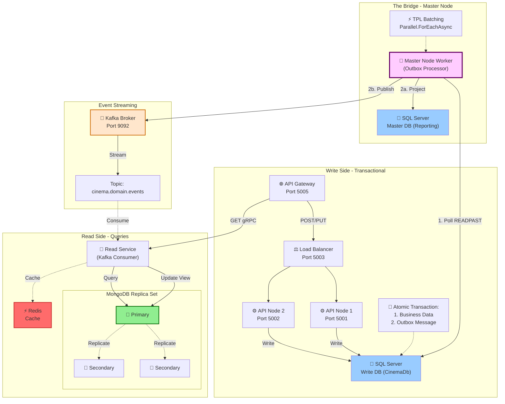

#  Cinema Booking System - CQRS + Outbox Pattern

A distributed cinema booking system implementing **CQRS** with the **Transactional Outbox Pattern** for guaranteed event delivery.

##  Architecture

## ✨ Key Features

### 🎯 Architectural Patterns
- **CQRS**: Separate read and write models for optimal performance
- **Transactional Outbox**: Guarantees event delivery without distributed transactions
- **Event Sourcing**: Domain events captured and streamed via Kafka
- **Eventual Consistency**: Read models updated asynchronously

### 🚀 Technical Highlights
- **Load Balanced Write Side**: Horizontal scaling with multiple API nodes
- **READPAST Locking**: Concurrent outbox processing without blocking
- **TPL Batching**: `Parallel.ForEachAsync` for high-throughput event processing
- **MongoDB Replica Set**: High availability for read operations
- **Redis Caching**: Sub-millisecond query response times
- **gRPC**: High-performance query service

## 🛠️ Technology Stack

| Component | Technology |
|-----------|-----------|
| **API Gateway** | YARP / Ocelot |
| **Write Database** | SQL Server |
| **Read Database** | MongoDB (Replica Set) |
| **Cache** | Redis |
| **Message Broker** | Apache Kafka |
| **API Framework** | ASP.NET Core |
| **Query Protocol** | gRPC |
| **Background Workers** | .NET Hosted Services |

## 📦 Components

### Write Side (Command)
- **API Gateway** (Port 5005): Entry point for all requests
- **Load Balancer** (Port 5003): Distributes traffic across API nodes
- **API Nodes** (Ports 5001-5002): Handle commands and write to SQL Server
- **SQL Server**: Transactional write database with Outbox table

### The Bridge (Master Node)
- **Outbox Processor**: Background worker that:
  1. Polls outbox messages using `READPAST` hint
  2. Projects data to reporting database
  3. Publishes events to Kafka
- **Master SQL Server**: Centralized reporting database

### Event Streaming
- **Kafka Broker** (Port 9092): Event streaming platform
- **Topic**: `cinema.domain.events` for all domain events

### Read Side (Query)
- **Read Service**: Kafka consumer updating MongoDB views
- **MongoDB Replica Set**: 
  - 1 Primary (writes)
  - 2 Secondaries (read scaling)
- **Redis**: Query result caching
- **gRPC**: High-performance query API

## 🔄 Data Flow

### Command Flow (Write)
1. Client sends POST/PUT → API Gateway
2. Load Balancer routes to available API node
3. API Node executes **atomic transaction**:
   - Writes business data
   - Inserts outbox message
4. Transaction commits (both or neither)

### Event Processing (Bridge)
1. Master Node polls outbox with `READPAST` hint
2. Processes messages in parallel batches
3. Projects data to Master SQL
4. Publishes events to Kafka
5. Marks messages as processed

### Query Flow (Read)
1. Client sends GET → API Gateway
2. Read Service queries MongoDB Primary
3. Checks Redis cache first
4. Returns gRPC response

## 🚀 Getting Started

### Prerequisites
- .NET 8.0 SDK
- Docker & Docker Compose
- SQL Server
- MongoDB
- Redis
- Apache Kafka

