# 🎬 Cinema Booking System - CQRS + Outbox Pattern

A distributed cinema booking system implementing **CQRS**, **DDD**, and the **Transactional Outbox Pattern** for guaranteed event delivery.

## 🏗️ Architecture Overview

```mermaid
graph TD
    subgraph "Write Side - Transactional"
        Gateway["🌐 API Gateway<br/>Port 5005"]
        LB["⚖️ Load Balancer<br/>Port 5003"]
        API1["⚙️ API Node 1<br/>Port 5001"]
        API2["⚙️ API Node 2<br/>Port 5002"]
        SQL["💾 SQL Server<br/>Write DB (CinemaDb)"]
        
        note_trans["📝 Atomic Transaction:<br/>1. Business Data<br/>2. Outbox Message"]
    end
    
    subgraph "The Bridge - Master Node"
        MasterNode["👷 Master Node Worker<br/>(Outbox Processor)"]
        MasterSQL["💾 SQL Server<br/>Master DB (Reporting)"]
        
        note_tpl["⚡ TPL Batching<br/>Parallel.ForEachAsync"]
    end
    
    subgraph "Event Streaming"
        Kafka["📨 Kafka Broker<br/>Port 9092"]
        Topic1["Topic: cinema.domain.events"]
    end
    
    subgraph "Read Side - Queries"
        ReadService["🚀 Read Service<br/>(Kafka Consumer)"]
        
        subgraph "MongoDB Replica Set"
            Mongo1["🍃 Primary"]
            Mongo2["🍃 Secondary"]
            Mongo3["🍃 Secondary"]
        end

        Redis["⚡ Redis<br/>Cache"]
    end

    %% Command Flow
    Gateway -->|POST/PUT| LB
    LB --> API1
    LB --> API2
    
    API1 -->|Write| SQL
    API2 -->|Write| SQL
    note_trans -.-> SQL

    %% The Outbox Pattern (Master Node)
    MasterNode -->|1. Poll READPAST| SQL
    MasterNode -->|2a. Project| MasterSQL
    MasterNode -->|2b. Publish| Kafka
    note_tpl -.-> MasterNode
    
    %% Event Flow
    Kafka -->|Stream| Topic1
    Topic1 -.->|Consume| ReadService
    
    %% Read Side Updates
    ReadService -->|Update View| Mongo1
    Mongo1 -.->|Replicate| Mongo2
    Mongo1 -.->|Replicate| Mongo3
    
    %% Query Flow
    Gateway -->|GET gRPC| ReadService
    ReadService -->|Query| Mongo1
    ReadService -.->|Cache| Redis
    
    %% Styling
    style MasterNode fill:#ffccff,stroke:#660066,stroke-width:3px
    style SQL fill:#99ccff
    style MasterSQL fill:#99ccff
    style Kafka fill:#ffe6cc,stroke:#cc6600,stroke-width:2px
    style Mongo1 fill:#90ee90,stroke:#006400,stroke-width:2px
    style Redis fill:#ff6b6b,stroke:#c92a2a,stroke-width:2px
```

## 🔄 Complete Data Flow

The following diagram shows the end-to-end data flow from user request to query response:

```mermaid
graph TD
    %% ---------------------------------------------------------
    %% ACTORS & ENTRY POINTS
    %% ---------------------------------------------------------
    User((👤 User))
    Gateway["🌐 API Gateway"]
    LoadBalancer["⚖️ Load Balancer"]
    
    %% ---------------------------------------------------------
    %% WRITE SIDE (TRANSACTIONAL)
    %% ---------------------------------------------------------
    subgraph WriteBlock["Write Side (Cinema API)"]
        API["⚙️ Cinema API Node"]
        
        subgraph Transaction["Atomic Transaction"]
            direction TB
            Step1["1. Write Reservation Data"]
            Step2["2. Write Outbox Message"]
        end
        
        SQL[("💾 SQL Server (CinemaDb)<br/>Tables: Reservations, OutboxMessages")]
    end

    %% ---------------------------------------------------------
    %% ASYNC PROCESSING (MASTER NODE)
    %% ---------------------------------------------------------
    subgraph MasterBlock["Async Processing (Master Node)"]
        Poller["🔄 Poller Thread"]
        Channel["⚡ Memory Channel"]
        Worker["👷 Worker Thread (TPL)"]
        
        MasterDB[("💾 Master DB (Reporting)")]
    end

    %% ---------------------------------------------------------
    %% EVENT STREAMING
    %% ---------------------------------------------------------
    Kafka["📨 Kafka Topic: cinema.reservations"]

    %% ---------------------------------------------------------
    %% READ SIDE (QUERIES)
    %% ---------------------------------------------------------
    subgraph ReadBlock["Read Side (Read Service)"]
        Consumer["📥 Kafka Consumer"]
        Mongo[("🍃 MongoDB (Read Model)")]
        Redis[("⚡ Redis Cache")]
    end

    %% ---------------------------------------------------------
    %% FLOW CONNECTIONS
    %% ---------------------------------------------------------
    
    %% 1. User Request
    User -->|POST /reservations| Gateway
    Gateway --> LoadBalancer
    LoadBalancer --> API
    
    %% 2. Transactional Write
    API --> Step1
    Step1 --> Step2
    Step2 -->|Commit| SQL
    
    %% 3. Polling & Processing
    Poller -->|Poll READPAST| SQL
    SQL -->|Batch of Messages| Poller
    Poller -->|Push| Channel
    Channel -->|Pop| Worker
    
    %% 4. Dual Write (Projection)
    Worker -->|Project Data| MasterDB
    Worker -->|Publish Event| Kafka
    
    %% 5. Cleanup
    Worker -.->|Mark Processed| SQL
    
    %% 6. Read Side Update
    Kafka -->|Consume Event| Consumer
    Consumer -->|Update View| Mongo
    Mongo -.->|Invalidate/Update| Redis
    
    %% Styling
    style User fill:#fff,stroke:#333,stroke-width:2px
    style SQL fill:#bbdefb,stroke:#1565c0
    style MasterDB fill:#e1bee7,stroke:#7b1fa2
    style Mongo fill:#c8e6c9,stroke:#2e7d32
    style Kafka fill:#ffe0b2,stroke:#ef6c00
    style Channel fill:#fff9c4,stroke:#fbc02d
```

### Data Flow Stages

#### 1️⃣ **Command Processing (Write Side)**
- User sends `POST /reservations` to API Gateway
- Load Balancer routes to available API node
- API executes **atomic transaction**:
  - Writes reservation to `Reservations` table
  - Writes outbox message to `OutboxMessages` table
- Both succeed or both fail (ACID guarantee)

#### 2️⃣ **Async Event Processing (Master Node)**
- **Poller Thread**: Polls outbox using `WITH (READPAST)` hint
  - Avoids blocking locked rows
  - Fetches batch of unprocessed messages
- **Memory Channel**: Thread-safe queue for message batching
- **Worker Thread**: Processes messages using `Parallel.ForEachAsync`
  - Projects data to Master Reporting DB
  - Publishes events to Kafka
  - Marks messages as processed

#### 3️⃣ **Event Streaming**
- Domain events flow through Kafka topic: `cinema.reservations`
- At-least-once delivery guarantee
- Multiple consumers can subscribe

#### 4️⃣ **Read Model Update**
- **Kafka Consumer** receives events
- Updates denormalized MongoDB view
- Invalidates/updates Redis cache
- Read model eventually consistent with write model

#### 5️⃣ **Query Processing**
- User sends `GET` request via gRPC
- Read Service checks Redis cache first
- On cache miss, queries MongoDB
- Returns optimized denormalized view

## 🎯 Domain-Driven Design (DDD)

The system is organized around **bounded contexts** with clear domain boundaries and aggregate roots that maintain consistency.

### Bounded Contexts

#### 🎫 Reservation Context (Core Domain)
The heart of the business - manages seat reservations with strict consistency rules.

- **Aggregate Root**: `Reservation`
  - Enforces business rules (seat availability, time limits)
  - Contains `ReservationSeat` entities
  - Uses `ReservationStatus` value object (Pending, Confirmed, Cancelled)
- **Domain Events**: `ReservationCreated`, `ReservationConfirmed`, `ReservationCancelled`
- **Invariants**: No double-booking, reservation timeout enforcement

#### 🎬 Showtime Context (Supporting Domain)
Manages movie screening schedules and auditorium assignments.

- **Aggregate Root**: `Showtime`
  - References `MovieId`, `AuditoriumId` (value objects)
  - Manages `ScreeningTime` scheduling
- **Domain Events**: `ShowtimeCreated`
- **Invariants**: No overlapping showtimes in same auditorium

### DDD Patterns Applied

- **Aggregates**: Transactional consistency boundaries
- **Value Objects**: Immutable domain concepts (IDs, Status, Time)
- **Domain Events**: First-class business occurrences
- **Repositories**: Aggregate persistence abstraction
- **Ubiquitous Language**: Business terms in code

## ✨ Key Features

### 🎯 Architectural Patterns
- **CQRS**: Separate read and write models for optimal performance
- **DDD**: Domain-driven design with bounded contexts and aggregates
- **Transactional Outbox**: Guarantees event delivery without distributed transactions
- **Event Sourcing**: Domain events captured and streamed via Kafka
- **Eventual Consistency**: Read models updated asynchronously

### 🚀 Technical Highlights
- **Load Balanced Write Side**: Horizontal scaling with multiple API nodes
- **READPAST Locking**: Concurrent outbox processing without blocking
- **TPL Batching**: `Parallel.ForEachAsync` for high-throughput event processing
- **Memory Channel**: Producer-consumer pattern for efficient message handling
- **MongoDB Replica Set**: High availability for read operations
- **Redis Caching**: Sub-millisecond query response times
- **gRPC**: High-performance query service

## 🛠️ Technology Stack

| Component | Technology |
|-----------|-----------|
| **API Gateway** | YARP / Ocelot |
| **Write Database** | SQL Server |
| **Read Database** | MongoDB (Replica Set) |
| **Cache** | Redis |
| **Message Broker** | Apache Kafka |
| **API Framework** | ASP.NET Core |
| **Query Protocol** | gRPC |
| **Background Workers** | .NET Hosted Services |
| **Async Processing** | System.Threading.Channels |

## 📦 Components

### Write Side (Command)
- **API Gateway** (Port 5005): Entry point for all requests
- **Load Balancer** (Port 5003): Distributes traffic across API nodes
- **API Nodes** (Ports 5001-5002): Handle commands and write to SQL Server
- **SQL Server**: Transactional write database with Outbox table

### The Bridge (Master Node)
- **Poller Thread**: Continuously polls outbox using `READPAST` hint
- **Memory Channel**: Thread-safe queue for message batching
- **Worker Thread**: Background worker that:
  1. Processes messages in parallel using TPL
  2. Projects data to reporting database
  3. Publishes events to Kafka
  4. Marks messages as processed
- **Master SQL Server**: Centralized reporting database

### Event Streaming
- **Kafka Broker** (Port 9092): Event streaming platform
- **Topic**: `cinema.domain.events` for all domain events

### Read Side (Query)
- **Read Service**: Kafka consumer updating MongoDB views
- **MongoDB Replica Set**: 
  - 1 Primary (writes)
  - 2 Secondaries (read scaling)
- **Redis**: Query result caching
- **gRPC**: High-performance query API

## 🚀 Getting Started

### Prerequisites
- .NET 8.0 SDK
- Docker & Docker Compose
- SQL Server
- MongoDB
- Redis
- Apache Kafka

